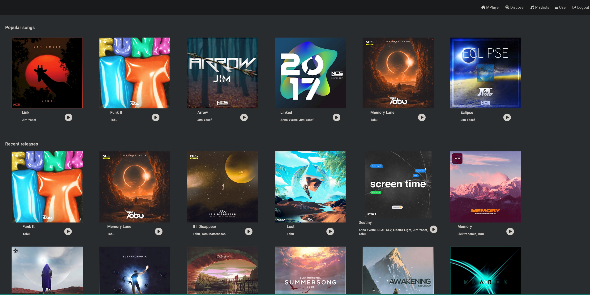
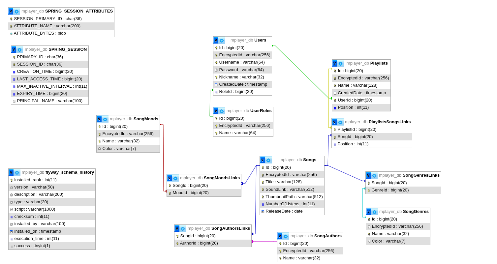
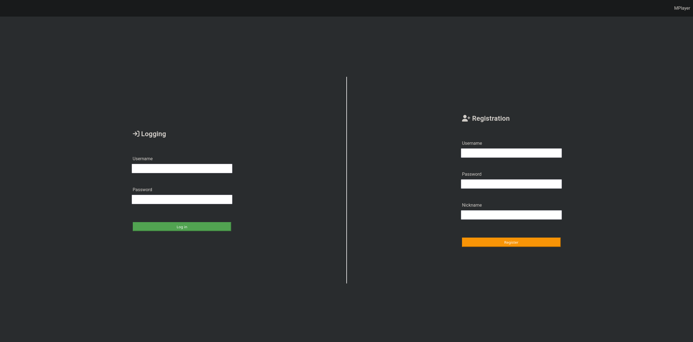
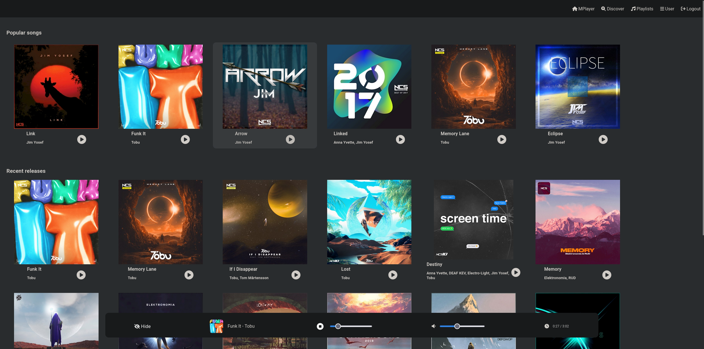
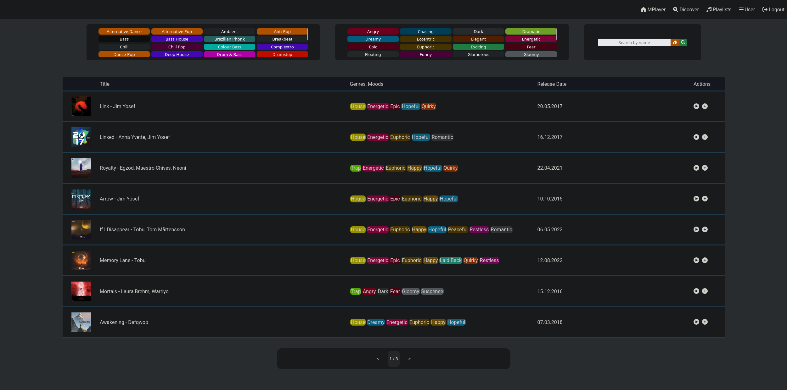
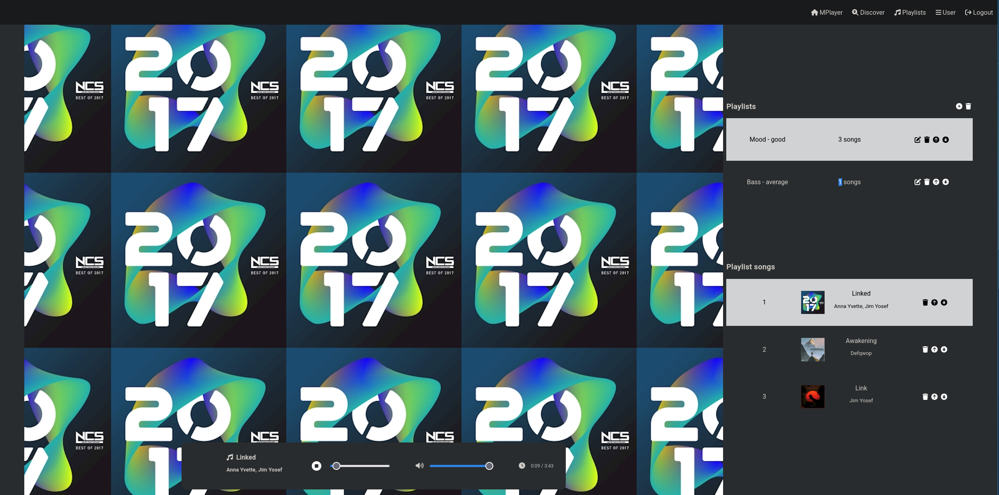
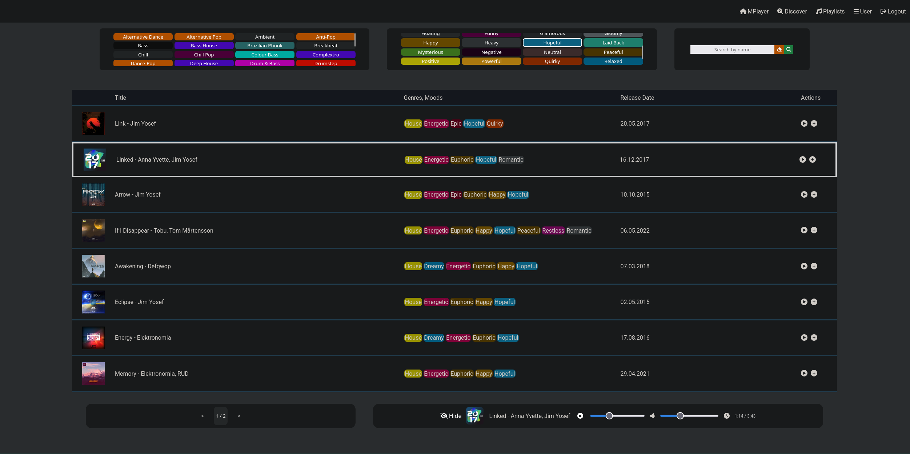
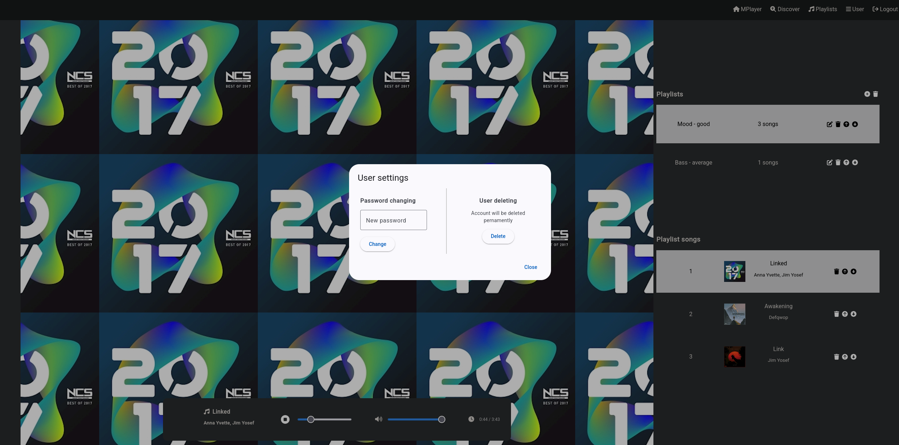

# MPlayer

<h3>Music player written in Java and Angular</h3>

## Features
- <b>Frontend</b>
  - Registration component
  - Logging component
  - Listening musics
  - Discovering musics
  - Saving favourite songs to created playlists
  - Playlists management
- <b>Backend</b>
  - Maven Multimodule structure
  - Authorization based on Session Cookie (JDBC Session)
  - Included tests (Mockito, Junit, Testcontaienrs)
  - SOLID Architecture
 
## Stack technology
| Technology       | Additional Info |
| -----------------| --------------- |
| Operating System | Linux           |
| Java             | Version: 17     |
| MariaDB          | Version: 10.11  |
| Angular          | Version: 19.0.6 |
| Node             | Version: 22.14  |
| Spring Boot      | Version: 3.3.5  |
| Spring Security  |                 |
| Flyway           |                 |
| Testcontainers   |                 |
| Lombok           |                 |

## More images

